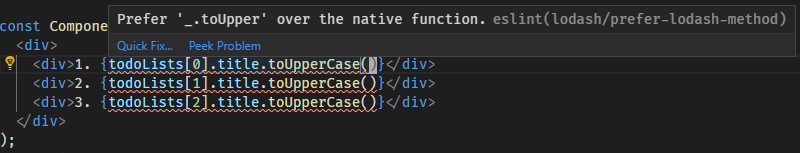
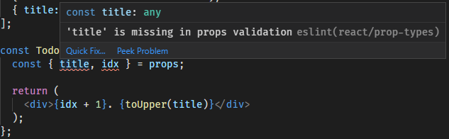

# Passing Data Between Components

React is strict when it comes to the direction we pass data. Data _always_
flows from a **parent** to a **child**, never the other way around. It is
prohibitively difficult to read data from a child component, so you should
avoid trying to break React and do something it wasn't meant to do or you'll
just end up with bugs all over the place and a bad taste in your mouth.

Alright, let's decide what type of app we're going to write. How about...

## The Todo List

The Todo List. Typical. Easy to understand. Simple. The perfect tutorial app.
We're going to write a nice, simple todo list which enables us to do CRUD
operations on checklists, and check off items in a checklist to track our
progress.

// todo: insert pictures of finished app

## The First Component

We need to start with our basic app, and then we'll pull Components out as it
gets too complex. This keeps us from over extracting Components while keeping
our code relatively clean. The first screen we want to show the user will
be a list of all our todo lists. Let's start by modifying our App file to include
some sample data. Add the following below the `import` statements:

```jsx
const todoLists = [
  { title: 'My First List' },
  { title: 'React 101 Lesson Plan' },
  { title: 'Shopping List' },
];
```

Next, we'll use this data and render it in our Component. Update your
component to look like this:

```jsx
const Component = () => (
  <div>
    <div>{todoLists[0].title}</div>
    <div>{todoLists[1].title}</div>
    <div>{todoLists[2].title}</div>
  </div>
)
```

Save and refresh the browser. You should see this:


Cool! Let's make it a little more interesting. Let's uppercase the list
titles, and add the non-programmer numbering to each `div`.
 
```jsx
  <div>
    <div>1. {todoLists[0].title.toUpperCase()}</div>
    <div>2. {todoLists[1].title.toUpperCase()}</div>
    <div>3. {todoLists[2].title.toUpperCase()}</div>
  </div>
```

Uh oh! You've probably noticed a bunch of red squiggles under those three
lines. Mousing over them reveals an error message:



> #### A Case for Lodash
> 
> Lodash is a large topic of controversy. Some people love it, some people hate
it. I'm a lodash lover. It provides methods that handle undefined, convenient
helpers for objects to match the array functions, and an entire functional
programming library. This tutorial will include lodash methods. I encourage
you to try them out. Additionally, it will be using the functional
programming extensions. **Everything in this tutorial can be done without
lodash, although it might be harder**. You can disable
`plugin:lodash/recommended` in the `.eslintrc.js` file if you really hate
lodash and do it all by hand.

Let's go ahead and import the lodash `toUpper` method and use it instead of
the native `toUpperCase` method. Add the following import:

```js
import toUpper from 'lodash/fp/toUpper'
```

And then update your code:

```jsx
  <div>
    <div>1. {toUpper(todoLists[0].title)}</div>
    <div>2. {toUpper(todoLists[1].title)}</div>
    <div>3. {toUpper(todoLists[2].title)}</div>
  </div>
```

The lodash `toUpper` method is safe from falsy values. It will simply return
an empty string instead of throwing an error if you pass an undefined to it.
The same can't be said for that `.title` operation. If we attempt to access
an element at an index we don't have declared, we'll still get that nasty
undefined error. **This is Bad**. React has something called [Error
Boundaries](https://reactjs.org/docs/error-boundaries.html), but those are
beyond the scope of this tutorial. What you must remember at all times is
that if there are ANY errors during the rendering of a component, the ENTIRE
APP will not render. **This is REALLY Bad**. We need to make sure we don't
throw errors like that. We can use another lodash method to safeguard us
against these undefined errors:

```jsx
import get from 'lodash/fp/get';

// ...

  <div>
    <div>1. {toUpper(get('[0].title', todoLists))}</div>
    <div>2. {toUpper(get('[1].title', todoLists))}</div>
    <div>3. {toUpper(get('[2].title', todoLists))}</div>
  </div>
```

Now we're safely guarded against nulls and our app can't possibly NOT render,
even if we delete the `todoLists` variable. If we had to write this over and
over again, React wouldn't be a very useful framework. Looking at the code we
can see obvious repetition. Any time we see a pattern we can probably extract
it into a method. React is no different. Let's extract this into a method.

## Sub-Components

React components are nothing more than methods that return JSX. In fact, JSX
is just a fancy syntax for invoking methods! We're going to pull the titles
out into their own component so it can be reused and not repeated. In order
to be used with the JSX syntax, our method **must** start with a capital
letter.

Create a new function in the file named `TodoListTitle`:

```jsx
const TodoListTitle = (props) => {
  const { title, idx } = props;

  return (
    <div>{idx + 1}. {toUpper(title)}</div>
  );
}
```

> #### ES6 Syntax: Destructuring
>
> ```jsx
> const { title, idx } = props;
> ```
> This is called _destructuring_. It is equivalent to:
> ```jsx
> const title = props.title;
> const idx = props.idx;
> ```
> `eslint` has a rule called `prefer-destructuring` that will remind you of
this shorthand syntax. You may actually have noticed eslint fixed it for you
when you saved!

Then change our list to be:

```jsx
  <div>
    <TodoListTitle idx={0} title={get('[0].title', todoLists)} />
    <TodoListTitle idx={1} title={get('[1].title', todoLists)} />
    <TodoListTitle idx={2} title={get('[2].title', todoLists)} />
  </div>
```

More `eslint` errors! That thing is such a pain! It's fantastic. Learn to
love eslint, because it's your first line of defense against Bad Code.



This specific error means that we're missing validation for our props. Let's
ignore this error for a quick minute while we discuss JSX props.

## Props

We pass data from one component to another via **props**. Props look like
HTML attributes and can either be string values:

```jsx
<Link href="/path/to/something" />
```

or JavaScript values:

```jsx
<TodoListTitle title={get('[0].title', todoLists)}
```
is equivalent to:
```jsx
const props = {
  title: get('[0].title', todoLists),
};
TodoListTitle(props)
```

Because JavaScript is a weakly typed language, we don't get compile time
errors if we pass the wrong value to a function. **PropTypes** provide
_runtime_ type checking so we can determine if we've passed an invalid value.
Validation failure does **NOT** prevent rendering of the application, but
will spit out an error in the browser console. Let's add some prop validation
to quiet that error.

Below your `TodoListTitle` Component, add these prop validations:

```jsx
import PropTypes from 'prop-types';

// ...

TodoListTitle.propTypes = {
  title: PropTypes.string.isRequired,
  idx: PropTypes.number.isRequired,
};
```

This tells React that both the `title` and `idx` properties are required and
what types to expect. If we pass a number into `title`, or a string into
`idx`, we'll get an error in the console warning us we've passed something
wrong.

All the available PropTypes can be found in the [documentation](https://www.npmjs.com/package/prop-types).

Don't ignore Prop Types validation messages! If you see an error in the
console from React, **DON'T IGNORE IT**. Your app **WILL** crash eventually,
and figuring out which of 100 error messages is causing your app not to
render is not fun. Go fix the prop validation errors as they come up.

## Splitting Components Between Files

Generally its a bad practice to define multiple Components in the same file.
It discourages code reuse and makes Component files huge. Let's make a new
file in `src` called `TodoTitleComponent.js` and move the function in there,
along with any imports it needs. `eslint` will tell us when we're missing
imports and when our App has imports it doesn't need. Do this now.

```jsx
import React from 'react';
import PropTypes from 'prop-types';
import toUpper from 'lodash/fp/toUpper';

const TodoListTitle = (props) => {
  const { title, idx } = props;

  return (
    <div>{idx + 1}. {toUpper(title)}</div>
  );
};
TodoListTitle.propTypes = {
  title: PropTypes.string.isRequired,
  idx: PropTypes.number.isRequired,
};

export default TodoListTitle;
```

Now we need to import it in our `App.js` file. Imports from local files look
almost the same as imports from packages, except that they must be relative
paths.

Add the import from `TodoListTitle.js` in `App.js` now:

```jsx
import TodoListTitle from './TodoListTitle';
```

> #### eslint rule: import/order
> 
> This rule ensures that all your package imports come before your relative
imports. This makes it easy to identify dependencies you own vs ones you only
use. `eslint` will auto fix this for you on save.

## Cleaning Up

There's one more thing we can do to clean up the `TodoListTitle` Component.
ES6 supports **parameter destructuring**. Instead of defining a parameter
named `props` and then destructuring it, we can do the following and inline
the destructuring:

```jsx
const TodoListTitle = ({ title, idx }) => {
  return (
    <div>{idx + 1}. {toUpper(title)}</div>
  );
};
```

`eslint` will then immediately simplify the function to:

```jsx
const TodoListTitle = ({ title, idx }) => (
  <div>{idx + 1}. {toUpper(title)}</div>
);
```

for us, as its a single expression function now!

# Conclusions

In this lesson we learned how to pass data from one component to another via
**props**, how to validate those props using **PropTypes**, and how to import
those components from another file. We also learned some **lodash** and more
about **eslint**.

It's now time to commit your changes, `git merge lesson-04`, and continue on
to [Lesson 4 - Loops in JSX](04_Loops_In_JSX.md).
