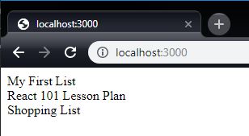

# Passing Data Between Components

React is strict when it comes to the direction we pass data. Data _always_
flows from a **parent** to a **child**, never the other way around. It is
prohibitively difficult to read data from a child component, so you should
avoid trying to break React and do something it wasn't meant to do or you'll
just end up with bugs all over the place and a bad taste in your mouth.

Alright, let's decide what type of app we're going to write. How about...

## The Todo List

The Todo List. Typical. Easy to understand. Simple. The perfect tutorial app.
We're going to write a nice, simple todo list which enables us to do CRUD
operations on checklists, and check off items in a checklist to track our
progress.

// todo: insert pictures of finished app

## The First Component

We need to start with our basic app, and then we'll pull Components out as it
gets too complex. This keeps us from over extracting Components while keeping
our code relatively clean. The first screen we want to show the user will
be a list of all our todo lists. Let's start by modifying our App file to include
some sample data. Add the following below the `import` statements:

```jsx
const todoLists = [
  { title: 'My First List' },
  { title: 'React 101 Lesson Plan' },
  { title: 'Shopping List' },
];
```

Next, we'll use this data and render it in our Component. Update your
component to look like this:

```jsx
const Component = () => (
  <div>
    <div>{todoLists[0].title}</div>
    <div>{todoLists[1].title}</div>
    <div>{todoLists[2].title}</div>
  </div>
)
```

Save and refresh the browser. You should see this:



Cool! Let's make it a little more interesting. Let's uppercase the list
titles, and add the non-programmer numbering to each `div`.
 
```jsx
  <div>
    <div>1. {todoLists[0].title.toUpperCase()}</div>
    <div>2. {todoLists[1].title.toUpperCase()}</div>
    <div>3. {todoLists[2].title.toUpperCase()}</div>
  </div>
```

Uh oh! You've probably noticed a bunch of red squiggles under those three
lines. Mousing over them reveals an error message:


> #### A Case for Lodash
> 
> Lodash is a large topic of controversy. Some people love it, some people hate
it. I'm a lodash lover. It provides methods that handle undefined, convenient
helpers for objects to match the array functions, and an entire functional
programming library. This tutorial will include lodash methods. I encourage
you to try them out. Additionally, it will be using the functional
programming extensions. **Everything in this tutorial can be done without
lodash, although it might be harder**. You can disable
`plugin:lodash/recommended` in the `.eslintrc.js` file if you really hate
lodash and do it all by hand.

Let's go ahead and import the lodash `toUpper` method and use it instead of
the native `toUpperCase` method. Add the following import:

```js
import toUpper from 'lodash/fp/toUpper'
```

And then update your code:

```jsx
  <div>
    <div>1. {toUpper(todoLists[0].title)}</div>
    <div>2. {toUpper(todoLists[1].title)}</div>
    <div>3. {toUpper(todoLists[2].title)}</div>
  </div>
```

The lodash `toUpper` method is safe from falsy values. It will simply return
an empty string instead of throwing an error if you pass an undefined to it.
The same can't be said for that `.title` operation. If we attempt to access
an element at an index we don't have declared, we'll still get that nasty
undefined error. **This is Bad**. React has something called [Error
Boundaries](https://reactjs.org/docs/error-boundaries.html), but those are
beyond the scope of this tutorial. What you must remember at all times is
that if there are ANY errors during the rendering of a component, the ENTIRE
APP will not render. **This is REALLY Bad**. We need to make sure we don't
throw errors like that. We can use another lodash method to safeguard us
against these undefined errors:

```jsx
import get from 'lodash/fp/get';

// ...

  <div>
    <div>1. {toUpper(get('[0].title', todoLists))}</div>
    <div>2. {toUpper(get('[1].title', todoLists))}</div>
    <div>3. {toUpper(get('[2].title', todoLists))}</div>
  </div>
```

Now we're safely guarded against nulls and our app can't possibly NOT render,
even if we delete the `todoLists` variable. If we had to write this over and
over again, React wouldn't be a very useful framework. Looking at the code we
can see obvious repetition. Any time we see a pattern we can probably extract
it into a method. React is no different. Let's extract this into a method.

## Sub-Components

React components are nothing more than methods that return 