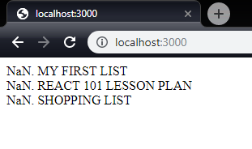
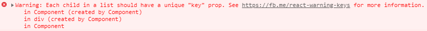

# Loops in JSX

One of the most common things we do when programming is loop over data. Most
data is in some form of list, and we want to process all the data in the list.
React is no different, although looping in JSX might seem different than what
you're used to.

Recall that JSX requires that the JavaScript inside the curly braces is
exactly one statement, and that statement is rendered inline. This means we
can't use a for loop to loop over data, as it isn't a single statement and
doesn't evaluate to anything. Instead, we must transform our data into
something React knows how to render.

React can only render five different things, called **nodes**:

1. Numbers - `<div>{5}</div>`
2. Strings - `<div>{'cat'}</div>`
3. DOM Elements - `<div>{<span>dog</span>}</div>`
4. Arrays of Nodes - `<div>{[1, 'cat', <span>dog</span>]}</div>`
5. Fragments - `<div>{<></>}</div>`

Because of this, an array of objects like our `todoLists` is invalid to be
rendered. Objects are not one of the five things React can render, so we must
transform it into one of the five. The most common would be to render a DOM
Element for each element in our list. We conveniently already have a
Component already defined (`TodoListTitle`) that we can use.

Instead of hard-coding all our list elements, let's make it dynamic by
calling `map` instead. We'll use the `lodash/fp` map function to avoid the
eslint error and gain all those features we talked about previously.

Change your `App.js` Component to the following:

```jsx
import map from 'lodash/fp/map';

// ...

const Component = () => (
  <div>
    {map((list, idx) => (
      <TodoListTitle idx={idx} title={get('title', list)} />
    ))(todoLists)}
  </div>
);
```

Refresh your browser and you should see:



Oh no! `NaN`! The `fp` extensions for `lodash` do something called
**capping** which means they don't get the optional parameters in the
iteratees. **This is a Good Thing**. Generally, we don't want to use the
index of an element in the array for anything, as it doesn't actually mean
anything to the element contained at that index. What if our array comes back
in a different order? Now all the numbering is off! Let's add a `priority`
field to our data to handle sorting and numbering:

```jsx
const todoLists = [
  { title: 'My First List', priority: 1 },
  { title: 'React 101 Lesson Plan', priority: 2 },
  { title: 'Shopping List', priority: 3 },
];
```

and then update our render to sort:

```jsx
import sortBy from 'lodash/fp/sortBy';

// ...

  <div>
    {sortBy('priority', map(list => (
      <TodoListTitle idx={get('priority', list)} title={get('title', list)} />
    ))(todoLists))}
  </div>
```

That is starting to look ugly. Let's clean it up with a little more lodash.
`flow` is a function that let's us chain other functions together by passing
the result of one function as the input to the next function. We can make
this more readable by utilizing `flow`:

```jsx
import flow from 'lodash/fp/flow';

// ...

  <div>
    {flow(
      sortBy('priority'),
      map(list => (
        <TodoListTitle idx={get('priority', list)} title={get('title', list)} />
      )),
    )(todoLists)}
  </div>
```

Our render method is starting to get a little complex. Looking at our
`App.js` file, if we didn't know what it was trying to render, we would have
to carefully read to understand that this is a sorted list of TodoListTitles.

Let's go ahead and extract out a new Component named `SortedListOfLists`.

```jsx
// src/SortedListOfLists.js
import React from 'react';
import PropTypes from 'prop-types';

import get from 'lodash/fp/get';
import map from 'lodash/fp/map';
import sortBy from 'lodash/fp/sortBy';
import flow from 'lodash/fp/flow';

import TodoListTitle from './TodoListTitle';

const Component = ({ todoLists }) => (
  flow(
    sortBy('priority'),
    map(list => (
      <TodoListTitle idx={get('priority', list)} title={get('title', list)} />
    )),
  )(todoLists)
);
Component.propTypes = {
  todoLists: PropTypes.arrayOf(
    PropTypes.shape({
      priority: PropTypes.number.isRequired,
      title: PropTypes.string.isRequired,
    }),
  ).isRequired,
};
export default Component;
```

> #### New PropTypes: arrayOf
> 
> `PropTypes.arrayOf` allows us to declare an array of any other PropTypes.
This could be `PropTypes.arrayOf(PropTypes.string)` or
`PropTypes.arrayOf(PropTypes.func)` or any other PropTypes.

> #### New PropTypes: shape
>
> `PropTypes.shape` allows us to declare an interface that a given object
must conform to. It is a keyed object of property names to expected PropType.

Additionally, update `App.js` to import the new `SortedListOfLists` component
and render it, passing in the `todoLists` property.

```jsx
import SortedListOfLists from './SortedListOfLists'

// ...

const Component = () => (
  <div>
    <SortedListOfLists todoLists={todoLists} />
  </div>
);
```

Now is also probably a good time to go remove the `{idx + 1}` from the
`TodoListTitle.js` file to correct the programmer numbering.

```jsx
// src/TodoListTitle.js

const TodoListTitle = ({ title, idx }) => (
  <div>{idx}. {toUpper(title)}</div>
);
```

## The `key` Property

If you've looked in your console by now, you've noticed that there is a
warning in the console:



This is informing us that we have forgotten to include a special property
named `key` on the elements in an array. When React renders an array, it uses
this `key` property to find the same element from the previous. The value you
pass should be unique to the **element in the array the key represents**, and
**NOT THE INDEX**. Read about [why you shouldn't use index as
key](https://github.com/yannickcr/eslint-plugin-react/blob/master/docs/rules/no-array-index-key.md).

Let's go ahead and use the title as the key:

```jsx
// src/SortedListOfLists.js

const Component = ({ todoLists }) => (
  flow(
    sortBy('priority'),
    map(({ priority, title }) => (
      <TodoListTitle
        key={title}
        idx={priority}
        title={title}
      />
    )),
  )(todoLists)
);
```

We've used parameter destructuring to remove the `get` calls. Make sure you
remove the import as it's no longer needed, and `eslint` will throw an error!

Refreshing the page should result in the warning about missing `key` going
away.

You can read more about keys
[here](https://reactjs.org/docs/lists-and-keys.html#keys).

# Conclusions

In this lesson we learned how to use **map** to render an array, as well as
practiced **extracting a component**. We also learned about `lodash`
**flow** and **sortBy**, and learned about the importance of the `key`
property when rendering arrays.

Commit your code to your branch, `git merge lesson-05`, and continue on to
[Lesson 5 - Callbacks](05_Callbacks.md).