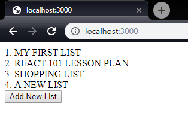

# State and Lifecycle

So React won't rerender if we modify data outside of it's realm of knowledge.
To account for this, React has provided something called **state** that
allows us to modify data and force a rerender.

To add state to a functional Component, we need to make use of one of another
function in the React package, named `useState`. Let's use it to move the array
of todo lists into the state so we can rerender them:

```jsx
// src/App.js
import React, { useState } from 'react';

// const todoLists = [
//   { title: 'My First List', priority: 1 },
//   { title: 'React 101 Lesson Plan', priority: 2 },
//   { title: 'Shopping List', priority: 3 },
// ];

const Component = () => {

  const [todoLists] = useState([
    { title: 'My First List', priority: 1 },
    { title: 'React 101 Lesson Plan', priority: 2 },
    { title: 'Shopping List', priority: 3 },
  ]);

  return (
    <div>
      <SortedListOfLists todoLists={todoLists} />
      <AddListButton onAddList={addList} />
    </div>
  )
};

```

> #### ES6 Syntax: Array Destructuring
> 
> ```jsx
> const [todoLists, setTodoLists] = useState(...);
> // is equivalent to...
> const result = useState(...);
> const todoLists = result[0];
> const setTodoLists = result[1];
> ```
> This syntax is a concise way of extracting elements from an array. The
variables declared in the square brackets take the value of the element at
the same index in the array. Additionally, we can skip a value by not putting
a variable in that index:
> ```jsx
> const [,,,d] = [1, 2, 3, 4, 5, 6, 7];
> 
> expect(d).toBe(4);
> ```

Now that we've introduced a `todoLists` state, we need to fix the
`addTodoList` function. It no longer has a reference to `todoLists` variable
to push! We want to keep it outside of our Component so we can unit test
it later, so lets just pass the `todoLists` in as a variable instead:

```jsx

  const addList = (todoLists, todoList) => {
    todoLists.push(todoList);
    console.log(todoLists);
  };

  // ...

  <AddListButton onAddList={newList => addList(todoLists, newList)} />
```

Now when we click the button...

Nothing. It **STILL** doesn't rerender! We should still see the console
output. That's because React React is not honoring your changes to state. In
React, **state** and **props** should be treated as **immutable**. Do NOT
change state or props E.V.E.R. You're going to cause yourself more trouble
than it's worth. Do not use the array methods that mutate the array. The
following methods should be off limits:

```jsx
copyWithin
fill
pop
push
reverse
shift
sort
splice
unshift
```

Instead, we should get in the practice of creating a new state with the
modified values, and set that to the variable. The `useState` function
has a second return value in the array: the `setState` function. We use
this to assign a new value back into the state, and queue a rerender.

```jsx
  const addList = (todoLists, setTodoLists, newList) => {
    const newLists = [
      ...todoLists,
      newList,
    ];

    setTodoLists(newLists);
  };

  const [todoLists, setTodoLists] = useState([
    // ...
  ]);

  <AddListButton onAddList={newList => addList(todoLists, setTodoLists, newList)} />
```

> #### ES6 Syntax: Array Spread operator
> 
> ES6 allows use to simplify creating new arrays by using the `...array` operator.
> Note that this does not clone the elements in the array, merely copies them into
> a new array.
> 
> ```jsx
> const ray = [1, 2, 3];
> const newRay = [
>   0,
>   ...ray,
>   5
> ];
> // is equivalent to...
> const newRay = [0, ray[0], ray[1], ray[2], 5];
> ```

We then pass the `setTodoLists` function into the `addList` function so that
it can use it to set the new array. Save, refresh, and click the button:



## Effects

It works! Now we're getting somewhere. While we're on the subject of fancy
React functions, we should talk about `useEffect`. This function allows us to
execute a function when values in our state or props change. Let's use
`useEffect` to update the priorities of the todo lists when we add multiple
lists.

```jsx
import React, { useState, useEffect } from 'react';

// ...

const Component = () => {
  const [todoLists, setTodoLists] = useState([
    // ...
  ]);

  const callback = () => {
    const reducer = (newLists, list) => [
      ...newLists,
      {
        ...list,
        priority: newLists.length + 1,
      },
    ];
    const updatedLists = reduce(reducer, [])(todoLists);

    setTodoLists(updatedLists);
  };

  useEffect(callback, [todoLists.length]);

  return (
    // ...
  );
};
```

Let's break this down. We invoke `useEffect` and pass in a callback function
to be executed when any value in the second argument changes:
```jsx
useEffect(callback, [todoLists.length]);
//           ^              ^
//   callback function      |
//           array of values to watch for changes
```
Whenever _any_ of the values in the array changes, we will execute the
callback. We can tweak how often the callback gets called by changing
what we pass into the array, or whether we even pass the array at all.
```jsx
useEffect(callback); // runs every time
useEffect(callback, []); // runs only the first time. There's no values
// to change, so it will never run again!
useEffect(callback, [valueA, valueB, valueC]) // runs whenever valueA OR
// valueB OR valueC changes. Be careful! If you change valueA, valueB, or
// valueC in the callback, the callback will run again!
```

> #### ES6 Syntax: Object Spread Operator
> 
> Just like arrays, Objects can be spread to create a new object containing
all the keys of the old object. We can `...obj` in any object literal,
> ```jsx
> const obj = { cat: 'meow', dog: 'ruff' };
> const animals = {
>   cat: 'purrrrr',
>   ...obj,
>   dog: 'woof'
> };
> expect(animals).toEqual({ cat: 'meow', dog: 'woof' });
> ```
> Properties get applied in order, so in the example, `cat: 'purrrr'` gets
> overridden by the `cat: 'meow'` from `obj`, and `dog: 'woof'` overrides
> `dog: 'ruff'`.

Generally, we wouldn't break the `useEffect` out into so many variables.
This has been done to make it easier to explain the different parts. A
more concise format would be:

```jsx
  useEffect(() => {
    setTodoLists(reduce((newLists, list) => [
      ...newLists,
      {
        ...list,
        priority: newLists.length + 1,
      },
    ], [])(todoLists));
  }, [todoLists.length]);
```

Make **SURE** you pass a function to use effect! Also, we **must** use curly
braces for the function to make it a void function or you'll get errors in
the console!

# Conclusions

In this lesson we learned about using `useState` to create objects in React
that we can modify with their setter function. We also learned about
**ES6 array and object spreading**, as well as how to use `useEffect` to
automatically run some code when values change.

In the next lesson, we'll learn how to get input from users using the
skills we already know so we can ask for a new list name!

Onwards! [Lesson 7 - Forms](07_Forms.md).

(Don't forget to commit your changes, and `git merge lesson-07`!)