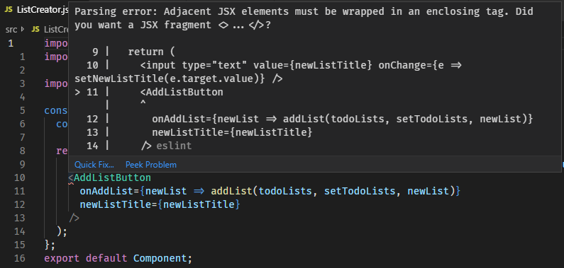

# Forms

The last part of the puzzle is how to get user input. Without user input, we
don't have an interactive application. React integrates very nicely with the
default HTML form elements. Let's add a text input to ask for the list title
before we add it to the array. Just like in HTML, we set the `value`
attribute to set the value of the input. We'll default it to "My New List"

```jsx
// src/App.js

  <div>
    <SortedListOfLists todoLists={todoLists} />
    <input type="text" value="My New List" />
    <AddListButton onAddList={newList => addList(todoLists, setTodoLists, newList)} />
  </div>
```

Refresh and you'll notice you can't change the input! That's because when you
change the input, React rerenders the Component, and set's the value to "My
New List"! We need to move the value into another state so it can change.

```jsx
const [newListTitle, setNewListTitle] = useState('My New List');

// ...

  <input type="text" value={newListTitle} onChange={e => setNewListTitle(e.target.value)} />
```

We've also added another event handler named `onChange`. It fires when the
input value changes. Imaginative, right? It receives the standard JavaScript
event object so we need to go through `.target.value` to get the actual value
of the text field. We then call `setNewListTitle` to update the state, which
causes a rerender, except this time the value of the text input is set to the
value in state, which we just updated! Now we can type in the text field and
change the value. When we press the button, it still says "A NEW LIST"
because we didn't pass the value of `newListTitle` into the `AddListButton`
Component. Let's do that now!

```jsx
<AddListButton
  onAddList={newList => addList(todoLists, setTodoLists, newList)}
  newListTitle={newListTitle}
/>
```

```jsx
// src/AddListButton.js

const Component = ({ onAddList, newListTitle }) => (
  <button onClick={() => onAddList({ title: newListTitle, priority: 4 })}>
    Add New List
  </button>
);
Component.propTypes = {
  // ...
  newListTitle: PropTypes.string.isRequired,
};
```

Cool! Now our text field dictates the title of the new list! This component
is getting a little crowded... It's time to pull some parts out!

Let's encapsulate the `useEffect` into it's own method and make a new
Component that houses the text input and the `AddListButton`.

## Pulling it Apart

In React, the methods that start with `use...` are called [**hooks**
(documentation)](https://reactjs.org/docs/hooks-overview.html). When we want
to extract hooks out into their own methods, we **must** name our method
starting with `use...` as well so React knows it contains hooks. hooks can
**ONLY** be used from within functional components and other hooks.

Let's pull it out:

```jsx
// src/App.js

const useReprioritizeLists = (todoLists, setTodoLists) => {
  useEffect(() => {
    setTodoLists(reduce((newLists, list) => [
      ...newLists,
      {
        ...list,
        priority: newLists.length + 1,
      },
    ], [])(todoLists));
  }, [todoLists.length]);
}

const Component = () => {
  // ...

  useReprioritizeLists(todoLists, setTodoLists);

  return (
    // ...
  )
}
```

This is already looking better. We have to pass in the `todoLists` and the
`setTodoLists` as dependencies, but now we can reuse this hook in another
component that needs to reprioritize lists! We can do one better though. What
if we have another component that needs to have the lists in it's state, as
well as keep them prioritized? We can reduce our dependency on the
`todoLists` and `setTodoLists` properties by moving the dependencies inside
the hook and returning them from our custom hook!

```jsx
// src/App.js


const useReprioritizeLists = () => {
  const [todoLists, setTodoLists] = useState([
    { title: 'My First List', priority: 1 },
    { title: 'React 101 Lesson Plan', priority: 2 },
    { title: 'Shopping List', priority: 3 },
  ]);

  useEffect(() => {
    // ...
  }, [todoLists.length]);

  return [
    todoLists,
    setTodoLists,
  ];
};


const Component = () => {
  const [todoLists, setTodoLists] = useReprioritizeLists();
  const [newListTitle, setNewListTitle] = useState('My New List');

  return (
    <div>
      <SortedListOfLists todoLists={todoLists} />
      <input type="text" value={newListTitle} onChange={e => setNewListTitle(e.target.value)} />
      <AddListButton
        onAddList={newList => addList(todoLists, setTodoLists, newList)}
        newListTitle={newListTitle}
      />
    </div>
  );
};
```

Our Component is starting to look concise and single purpose! This is the
goal. Next, let's make a new Component for encapsulating the list input
controls:

```jsx
// src/ListCreator.js
import React, { useState } from 'react';
import PropTypes from 'prop-types';

import AddListButton from './AddListButton';

const Component = ({ onAddList }) => {
  const [newListTitle, setNewListTitle] = useState('My New List');

  return (
    <input type="text" value={newListTitle} onChange={e => setNewListTitle(e.target.value)} />
    <AddListButton
      onAddList={newList => onAddList(newList)}
      newListTitle={newListTitle}
    />
  );
};
Component.propTypes = {
  onAddList: PropTypes.func.isRequired,
};
export default Component;
```

And we get an error. This error is telling us that we can't return multiple
JSX elements at a time. We have to return a single root. In HTML, we would
use a `<div>` to wrap them up, however that actually changes the structure of
the document. In React, we can use what's called a
[Fragment](https://reactjs.org/docs/fragments.html) to wrap multiple JSX
elements into one, but _not_ insert a DOM element.



You can either use the full tag name:
```jsx
<React.Fragment>
  <Element1></Element1>
  <Element2></Element2>
</React.Fragment>
```
Or the shorthand syntax:
```jsx
<>
  <Element1></Element1>
  <Element2></Element2>
</>
```

Let's wrap our two elements in a fragment:

```jsx
// src/ListCreator.js

return (
  <>
    <input type="text" value={newListTitle} onChange={e => setNewListTitle(e.target.value)} />
    <AddListButton
      onAddList={newList => addList(todoLists, setTodoLists, newList)}
      newListTitle={newListTitle}
    />
  </>
)
```

Refresh and everything should work the same, but now we have bite sized
components that have specific purposes instead of having it all jammed into
one.

Next up, styling. We'll make this look somewhat reasonable!

Do the git thing, then continue on to [Lesson 8 - Styling Components with
styled-components](08_Styling_Components_With_Styled_Components.md)