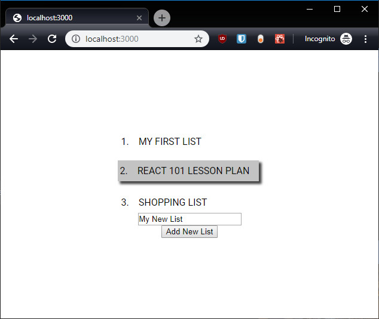

# Styling Components Using styled-components

There are many different ways to style components in React. We're going to
cover my favorite method: the
[styled-components](https://www.styled-components.com/) package. This allows
us to easily define css, provides nested styling like scss, and handles all
the naming for us without having to setup complex webpack loaders.

The `styled-components` package is already included in the `package.json`, so
we don't have to install anything.

We're going to be making the page look like this.

// todo insert picture of styled app.


## Centering the App

Let's begin by centering everything. In our `App.js`, we want to create an
element that will center all the children. We'll use `styled-components` to
do so:

```jsx
// src/App.js
import styled from 'styled-components';

const CenteredDiv = styled.div`
width: 100vw;
height: 100vh;
display: flex;
justify-content: center;
align-items: center;
`;

// ...

  return (
    <CenteredDiv>
      <SortedListOfLists todoLists={todoLists} />
      <ListCreator onAddList={newList => addList(todoLists, setTodoLists, newList)} />
    </CenteredDiv>
  );
```


## Aligning the List

Now it's centered, but we want to left align the list elements. We need to
make another container for them so they don't go to the left of the screen.

```jsx
// src/SortedListOfLists.js
import styled from 'styled-components';

const ColumnDiv = styled.div`
display: flex;
flex-direction: column;
`;

const Component = ({ todoLists }) => (
  <ColumnDiv>
    {flow(
      sortBy('priority'),
      map(({ priority, title }) => (
        <TodoListTitle
          key={title}
          idx={priority}
          title={title}
        />
      )),
    )(todoLists)}
  </ColumnDiv>
);
// ...
```


## The Title Card Padding

We want to give ourselves some breathing room on these title cards, so let's
add some padding. Generally, we don't want to specify margins inside a
component because those might be used by the parent to position our
Component.

```jsx
// src/TodoListTitle.js
import styled from 'styled-components';

const Priority = styled.span`
margin-right: 1em;
`;

const PaddedCard = styled.div`
padding: .5em 1em .5em .25em;
transition: all .1s ease-in-out;
cursor: pointer;

:hover {
  background-color: #C3C3C3;
  transform: translate(-2px, -2px);
  box-shadow: 4px 4px 4px 0px rgba(0,0,0,0.75);
}
`;

const TodoListTitle = ({ title, idx }) => (
  <PaddedCard>
    <Priority>{idx}.</Priority>
    <span>{toUpper(title)}</span>
  </PaddedCard>
);
```


## Margins Between the Title Cards

Looking better, but our title cards are still touching each other. Let's put
some margins between them in the `SortedListOfLists` Component.

```jsx
// src/SortedListOfLists.js

// we can style our custom components too!
const SpacedTodoListTitle = styled(TodoListTitle)`
&:not(:last-child) {
  margin-bottom: 1em;
}
`;

// ...

map(({ priority, title }) => (
  <SpacedTodoListTitle
    key={title}
    idx={priority}
    title={title}
  />
)),
```

It didn't work! That's because our custom Component (`TodoListTitle`) doesn't
accept a `className` property. In order to use it in `styled-components` we
need to accept in the `className` and set it on our component.

```jsx
// src/TodoListTitle.js

const TodoListTitle = ({ title, idx, className }) => (
  <PaddedCard className={className}>
    <Priority>{idx}.</Priority>
    <span>{toUpper(title)}</span>
  </PaddedCard>
);
TodoListTitle.propTypes = {
  // ...
  className: PropTypes.string,
}
```



## The Input Form

Lastly we want to make this input stuff a little prettier. Let's put a FAB
(Floating Action Button for all you non-material UI people), and have it
open a modal instead.

Let's start by adding the FAB to the `ListCreator` Component.

```jsx
// src/ListCreator.js
import styled from 'styled-components';

const Fab = styled.button`
position: fixed;
border: none;
right: 5rem;
bottom: 5rem;
width: 2em;
height: 2em;
font-size: 1.5em;
border-radius: 1em;
background-color: green;
box-shadow: 4px 4px 4px 0px rgba(0,0,0,0.75);
transition: all .1s ease-in-out;
cursor: pointer;

:focus {
  outline: none;
}
:hover {
  transform: translate(-2px, -2px);
  box-shadow: 6px 6px 6px 0px rgba(0,0,0,0.75);
}
:active {
  transform: translate(1px, 1px);
  box-shadow: 3px 3px 3px 0px rgba(0,0,0,0.75);
}
`;

// ...
return (
  <>
    <Fab>
      +
    </Fab>
    {/* ... */}
  </>
);
```

There. That looks nice and have some interaction so the user knows the
button is working.


Now we should make the modal. Again, we have to introduce another state to
manage whether the modal is open or not. Let's call this `modalOpen`. We'll
use it to conditionally render the modal. There's nothing fancy about not
rendering something. If React encounters a falsy value while rendering, it
just skips it, **EXCEPT FOR ZERO**. React renders `0`. Be careful with your
length checks and be explicit (e.g. `ray.length !== 0 && ...` instead of
`ray.length && ...`). So if `modalOpen` is true, we want to render the input
and the button.

```jsx
const Component = ({ onAddList }) => {
  const [newListTitle, setNewListTitle] = useState('My New List');
  const [modalOpen, setModalOpen] = useState(false);

  return (
    <>
      {modalOpen && (
        <div>
          <input type="text" value={newListTitle} onChange={e => setNewListTitle(e.target.value)} />
          <AddListButton
            onAddList={newList => onAddList(newList)}
            newListTitle={newListTitle}
          />
        </div>
      )}
      <Fab onClick={() => setModalOpen(true)}>
        +
      </Fab>
    </>
  );
};
```

## The Modal

Now clicking the FAB opens the inputs, but they're still not a modal. Let's
take care of that with another styled component:

```jsx
const Modal = styled.div`
position: absolute;
top: 50%;
left: 50%;
transform: translate(-50%, -50%);
display: flex;
flex-direction: column;
padding: 1em 1em .5em 1em;
background-color: white;
box-shadow: 4px 4px 4px 0px rgba(0,0,0,0.75);
border: 1px solid #ccc;

> * {
  margin-bottom: .5em;
}
`;

// ...

  {modalOpen && (
    <Modal>
      {/* ... */}
    </Modal>
  )}
```

We'll add a title to the modal, a cancel button, and put the buttons in a
row:

```jsx
const Modal = styled.div`
/* ... */

h2 {
  margin: 0;
  margin-bottom: 1em;
}
`;

const ActionButtons = styled.div`
display: flex;
> * {
  flex: 1 0 0%;
  &:not(:last-child) {
    margin-right: 1em;
  }
}
`;


{modalOpen && (
  <Modal>
    <h2>Create a new Todo List:</h2>
    <input type="text" value={newListTitle} onChange={e => setNewListTitle(e.target.value)} />
    <ActionButtons>
      <button onClick={() => setModalOpen(false)}>Cancel</button>
      <AddListButton
        onAddList={newList => onAddList(newList)}
        newListTitle={newListTitle}
      />
    </ActionButtons>
  </Modal>
)}
```

The last thing we want to do is close the modal when we add the list. We'll
have to declare our own onAddList function that closes the modal and then
invokes the props `onAddList` function:

```jsx
const closeModalAndAddList = (onAddList, setModalOpen, newList) => {
  setModalOpen(false);
  onAddList(newList);
}

const Component = ({ onAddList }) => {
  // ...

  return (
    // ...
      <AddListButton
        onAddList={newList => closeModalAndAddList(onAddList, setModalOpen, newList)}
        newListTitle={newListTitle}
      />
    // ...
  )
})
```

Refresh and behold the glory of our Todo List Creator!

# Conclusions

That's a lot of CSS. Hopefully you have a basic understanding of how
styled-components works. There is a lot more to styled-components, but [their
documentation](https://www.styled-components.com/) is a fantastic resource
for those topics.

The next lesson will deal with how to handle multiple views in the naive
approach and then with `react-router`.

Forward! [Lesson 9 - Views and Routing](09_Views_and_Routing.md)