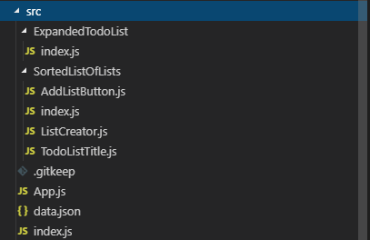

# Views and Routing

React wouldn't be nearly as useful if we had to write a separate html page
for each view. Instead, we can make a Single Page App (SPA) and do navigation
on the client side!

## The Naive Approach

Without any packages besides what we have installed, we can get started with
routing. Let's change our list view so when we click on a Todo List, we see
and expanded view with all our things to do on the list. The first thing
we'll need is a new Component to render the expanded Todo List. How about we
name it... `ExpandedTodoList`? Let's also put it in a folder so we can keep
it organized.

```jsx
// src/ExpandedTodoList/index.js

import React from 'react';

const Component = () => (
  <div></div>
);
export default Component;
```

Now lets set up being able to switch between the views. When we click on a
Todo list in the first view, we want to switch the entire view to the
Expanded Todo List view.

First we'll need some state to hold which view we're currently looking at:

```jsx
// src/App.js

const Component = () => {
  // ...
  const [view, setView] = useState('list');

  // ...
  return (
    <>
      {view === 'list' && (
        <CenteredDiv>
          <SortedListOfLists
            todoLists={todoLists}
            onClick={() => setView('expanded-list')}
          />
          <ListCreator onAddList={newList => addList(todoLists, setTodoLists, newList)} />
        </CenteredDiv>
      )}
      {view === 'expanded-list' && (
        <ExpandedTodoList />
      )}
    </>
  );
};
```

Notice we've also passed a callback to `SortedListOfLists` to tell it what to
do when a user clicks on a list. Go ahead and try on your own to implement
the `onClick` handler in the `SortedListOfLists`, and then check your answer
with the solution behind the spoiler below.

<details>
  <summary>/src/SortedListOfLists.js</summary>

```jsx
const Component = ({ todoLists, onClick }) => (
  <ColumnDiv>
    {flow(
      sortBy('priority'),
      map(({ priority, title }) => (
        <SpacedTodoListTitle
          key={title}
          idx={priority}
          title={title}
          onClick={() => onClick()}
        />
      )),
    )(todoLists)}
  </ColumnDiv>
);
Component.propTypes = {
  todoLists: PropTypes.arrayOf(
    PropTypes.shape({
      priority: PropTypes.number.isRequired,
      title: PropTypes.string.isRequired,
    }),
  ).isRequired,
  onClick: PropTypes.func.isRequired,
};
```
 
</details>

## The Expanded List View

Now when we click on a todo list, the screen should go blank! We have nothing
in our other view. Let's update our sample data from the first screen to be
a json file outside of our app. Eventually we'll pull this from the server,
but for now we can use a json file. Create a new file named `/src/data.json`:

<details>
<summary>/src/data.json</summary>

```json
[
  {
    "title": "My First List",
    "priority": 1,
    "items": [
      {
        "title": "First Item",
        "checked": true
      },
      {
        "title": "Second Item",
        "checked": false
      },
      {
        "title": "Third Item",
        "checked": false
      }
    ]
  },
  {
    "title": "React 101 Lesson Plan",
    "priority": 2,
    "items": [
      {
        "title": "Schedule ImprovingU",
        "checked": true
      },
      {
        "title": "Create Calendar Invite",
        "checked": false
      },
      {
        "title": "Show Up on Day 1",
        "checked": false
      },
      {
        "title": "Order Food for Day 2",
        "checked": true
      },
      {
        "title": "Show Up on Day 2",
        "checked": true
      }
    ]
  },
  {
    "title": "Shopping List",
    "priority": 3,
    "items": [
      {
        "title": "Ground Beef",
        "checked": false
      },
      {
        "title": "Spaghetti",
        "checked": true
      },
      {
        "title": "Pasta Sauce",
        "checked": true
      },
      {
        "title": "Salt",
        "checked": false
      }
    ]
  }
]
```

</details>

and then import it in `App.js`. Note you must specify `.json` since it isn't
a `.js` or `.jsx` file:

```jsx
import data from './data.json';

// ...
const useReprioritizeLists = () => {
  const [todoLists, setTodoLists] = useState(data);
  // ...
}
```

Now we've got some data for the expanded list view. We just need to determine
which list to show when we click on it, and then fill out the view. Let's go
ahead and change our `onClick` to the `SortedListOfLists` to set another
state storing which list we're viewing:

```jsx
// src/App.js

const expandList = (setCurrentList, setView, todoList) => {
  setCurrentList(todoList);
  setView('expanded-list');
};

const Component = () => {
  // ...
  const [currentList, setCurrentList] = useState();

  return (
    // ...
      <SortedListOfLists
        todoLists={todoLists}
        onClick={list => expandList(setCurrentList, setView, list)}
      />
    // ...
  );
};
```

We'll also have to change `SortedListOfLists` to pass the whole list object
as an argument to the `onClick`:

```jsx
// src/SortedListOfLists.js

const Component = ({ todoLists, onClick }) => (
  // ...
  map((list) => {
    const { priority, title } = list;

    return (
      <SpacedTodoListTitle
        key={title}
        idx={priority}
        title={title}
        onClick={() => onClick(list)}
      />
    );
  }),
);
```

The last part is actually building out the expanded list view to read all
this data we have:

```jsx
// src/ExpandedListView/index.js
import React, { useState } from 'react';
import PropTypes from 'prop-types';

import map from 'lodash/fp/map';

const Component = ({ todoList }) => {
  const [listItems] = useState(todoList.items);

  return (
    <div>
      <h1>{todoList.title}</h1>
      <ol>
        {map(listItem => (
          <li>
            <input type="checkbox" checked={listItem.checked} />
            <span>{listItem.title}</span>
          </li>
        ))(listItems)}
      </ol>
    </div>
  );
};
Component.propTypes = {
  todoList: PropTypes.shape({
    title: PropTypes.string.isRequired,
    items: PropTypes.arrayOf(
      PropTypes.shape({
        title: PropTypes.string.isRequired,
        checked: PropTypes.bool.isRequired,
      }),
    ),
  }).isRequired,
};
export default Component;
```

Now refresh everything a click a list! It changes to the new view with our
list of checkboxes!

## Routing

You may have pressed the back button and realized it didn't go back. That's
because we didn't actually change any browser history. We could continue the
naive approach and implement our own history management, url detection, etc.
but this is a difficult problem to get correct and often leads to failure.
Instead, let's use the most popular React routing library: `react-router`.

We'll need to install two packages first:

```
npm i react-router react-router-dom
```

The `react-router` package is the core router functionality, and the
`react-router-dom` package is how we manipulate the DOM based on routes. Both
are required.

Let's move the `SortedListOfLists` into it's own folder along with
`ListCreator` and `TodoListTitle` so that it has all of it's dependencies
along side it. Your folders should look like this:



Fix the imports in `App.js` and we should be ready to learn about
`react-router`

The first thing we need to do is import some things from `react-router-dom`.

```jsx
// src/App.js
import { BrowserRouter, Route } from 'react-router-dom';
```

`BrowserRouter` is a Component that handles all the url manipulation and
parsing for us, and `Route` allows us to define a component to render for a
specific url.

Generally `BrowserRouter` is the root component of your app so that a `Route`
can show up anywhere:

```jsx
// src/App.js

const Component = () => {
//...
  return (
    <BrowserRouter>
      {view === 'list' &&
        // ...
      }
      {view === 'expanded-list' &&
        // ...
      }
    </BrowserRouter>
  )
};
```

Then, we replace our hacky, naive `view` state with `Route`s!

```jsx
// src/App.js

const Component = () => {
//...
  return (
    <BrowserRouter>
      <Route path="/" exact component={() => (
        <CenteredDiv>
          <SortedListOfLists
            todoLists={todoLists}
            onClick={list => (window.location = `/${list.title}`)}
          />
          <ListCreator onAddList={newList => addList(todoLists, setTodoLists, newList)} />
        </CenteredDiv>
      )} />
      <Route path="/:title" exact component={({ match: { params: { title } } }) => (
        <ExpandedTodoList
          todoList={find({ title })(todoLists)}
        />
      )} />
    </BrowserRouter>
  );
};
```

> #### ES6 Syntax: Nested Destructuring
>
> ```jsx
>   <Route path="/:title" exact component={({ match: { params: { title } } }) => (
>     // ...
>   )} />
> 
> ({ match: { params: { title } } })
> // blown out:
> ({
>   match: {
>     params: {
>       title
>     }
>   }
> })
> // this is the same as:
> (param) => {
>   const title = param.match.params.title;
> }
> // it does NOT check for undefined! Be careful or set default values
> ```

# Conclusions

We now know how to handle routing on the client side, learned a new Lodash
method **find**, and have started making a real application that has
navigation!

# Free Time

Now we practice what we've learned. We need to flesh out this application.
Here are some ideas of what to work on:

1. Make the check/uncheck buttons work on the Expanded view
2. Allow adding new checklist items
3. Allow deleting checklist items
4. Ability to delete a list
5. Reorder lists
6. Reorder checklists
7. Style ALL the things!

Tomorrow we will begin learning how to retrieve things from the server with
Ajax, simplifying storage and data with Redux, and more!